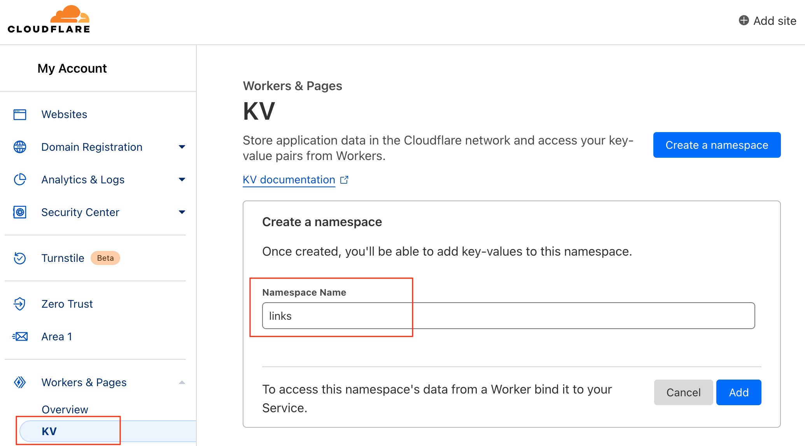

# Url-Shorten-Worker
A URL Shortener created using Cloudflare Worker

# API

[API Documentation (API Documentation)](docs/API.md)

# Getting start
### Go to Workers KV and create a namespace.

### Go to Worker Settings and select Bind KV Namespace

Bind an instance of a KV Namespace to access its data in a Worker.

### Fill in `LINKS` for Variable name, and select the namespace you just created for KV namespace

Where Variable name should be set as `LINKS` and KV namespace is the namespace you just created in the first step.

### Copy the `index.js` code from this project to Cloudflare Worker.

### Click Save and Deploy

Click Save and Deploy

# Demo
https://go.abdullahcoded.workers.dev/

Note: Because someone abuse this demo website, all the generated link will automatically expired after 24 hours. For long-term use, please deploy your own.

Note: All links generated by the Demo website will automatically expire after 24 hours. If you need long-term use, please build your own.

# crazypeace modified version

https://github.com/iemabdullah/Url-Shorten

Supported functions: 1. Custom short links 2. Short links set by page cache 3. Long link text box pre-search localStorage 4. Add a button to delete a short link 5. Password protection
